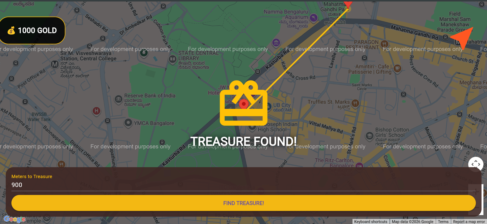

# 🏴‍☠️ Animated Treasure Hunt: Fitness & Gamification MVP

A Flutter-based web application that transforms running into a gamified adventure. Users can set custom distances, track their progress on a real-time map, and use an animated compass to find hidden "treasure" locations.

## 🚀 Key Features

### 🗺️ Dynamic Navigation

* **From-To Projection:** Users can input a starting coordinate and a target distance. The app mathematically projects a new treasure location based on Great Circle mathematics.
* **Proper Direction Bearing:** A custom algorithm calculates the exact bearing between the user and the goal to provide real-time directional guidance.
* **Path Visualization:** A golden dashed polyline connects the starting point to the target, showing the intended route.

### 🎭 "Fun First" Animations

* **Elastic Compass:** The navigation arrow uses `AnimatedRotation` with an `elasticOut` curve to snap and bounce like a real magnetic needle.
* **Pulsing Aura:** The active treasure location features a glowing, expanding amber circle to draw the runner's attention.
* **Treasure Burst:** A high-impact "Treasure Found" pop-up appears using a `ScaleTransition` and `bounceOut` curve when goals are reached.
* **Smooth Camera Follow:** The Google Map pans smoothly using `animateCamera` to keep the user at the center of the action.

### 🎮 Gamified HUD

* **Gold Counter:** A shimmering gold credit system that scales up when rewards are collected.
* **Themed Markers:** Distinct visual symbols for:
* 🏠 **Base Camp (House):** Your starting point (Azure).
* 🎁 **Treasure Chests:** Hidden rewards (Orange).
* ✅ **Collected Items:** Discovered treasures (Green).


## 🛠️ Technical Stack

* **Framework:** Flutter (Web)
* **Database:** Cloud Firestore (Real-time sync of treasure stops)
* **Mapping:** Google Maps Flutter Plugin
* **Location:** Geolocator (GPS tracking and distance calculation)
* **Animations:** Implicit (AnimatedRotation) and Explicit (AnimationController) Flutter animations.

## ⚙️ Installation & Setup

1. **Clone the repository:**
```bash
git clone https://github.com/your-username/treasure-hunt.git
cd treasure-hunt

```


2. **Firebase Configuration:**
* Create a project in the [Firebase Console](https://console.firebase.google.com/).
* Add a Web App and copy the `FirebaseOptions` config.
* Paste your config into the `Firebase.initializeApp` section in `lib/main.dart`.


3. **Google Maps API:**
* Enable **Maps JavaScript API** in the [Google Cloud Console](https://console.cloud.google.com/).
* Add your API Key to `web/index.html`:
```html
<script src="https://maps.googleapis.com/maps/api/js?key=YOUR_API_KEY"></script>

```


4. **Run the project:**
```bash
flutter run -d web-server

```


## 📸 Screenshots


## 📜 Future Roadmap

* **Speed Validation:** Add warnings if the user is moving at vehicle speeds (cheating detection).
* **Leveling System:** A progress bar that fills up as more gold is collected.
* **Pirate Theme:** Apply a custom "Old Scroll" Map Style to the Google Maps background.

---
